# 😄


# Laporan Praktikum Jaringan Komputer Modul 4 D14 2023 

## Penulis

- Mohammad Kamal (5025211180)
- Darren Prasetya (5025211162)

# Daftar Isi
1. [CPT - VLSM](#cpt---vlsm)
2. [GNS3 - CIDR](#gns3---cidr)

## Topologi
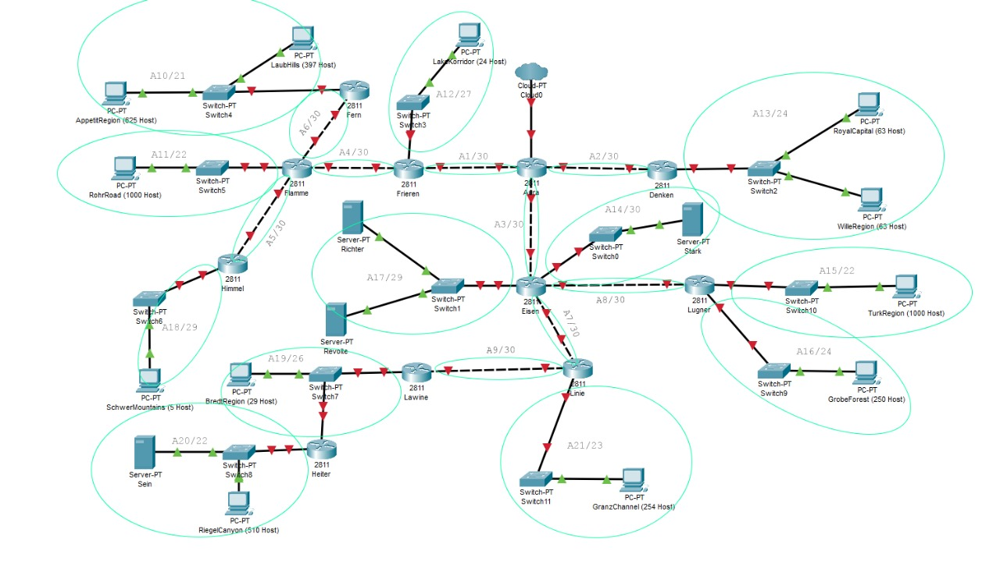

## Rute 
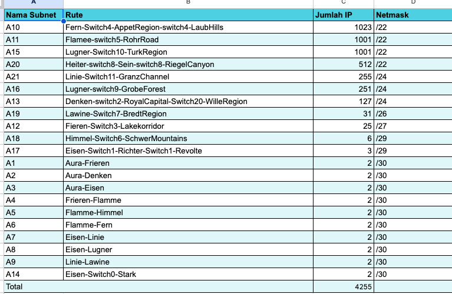

## CPT - VLSM

## Pembagian IP VLSM
  
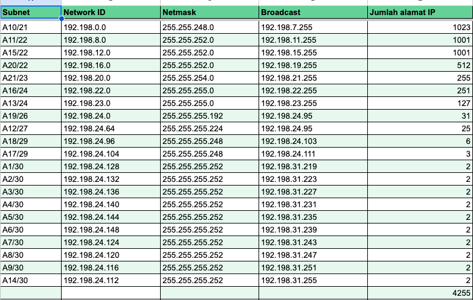


## VLSM Tree


## Konfigurasi VLSM CPT

### Setting Physical Router
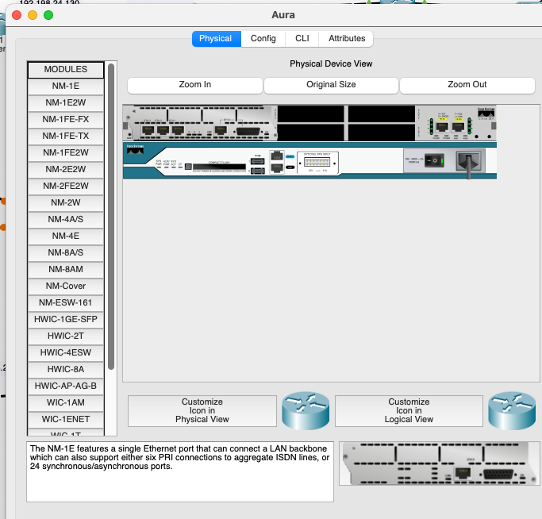

### Setting Configurasi Router Aura 
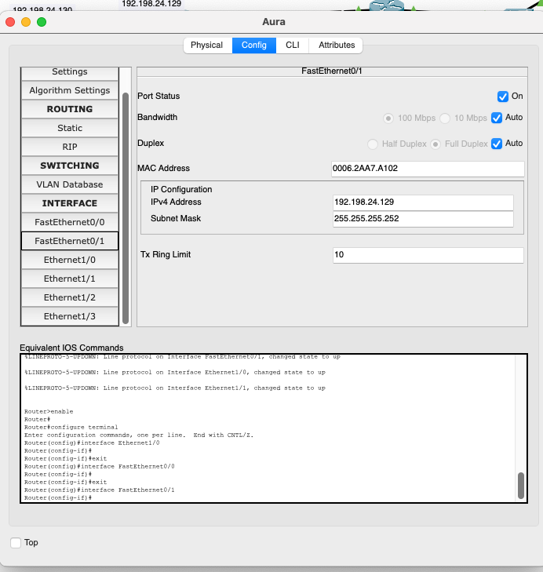
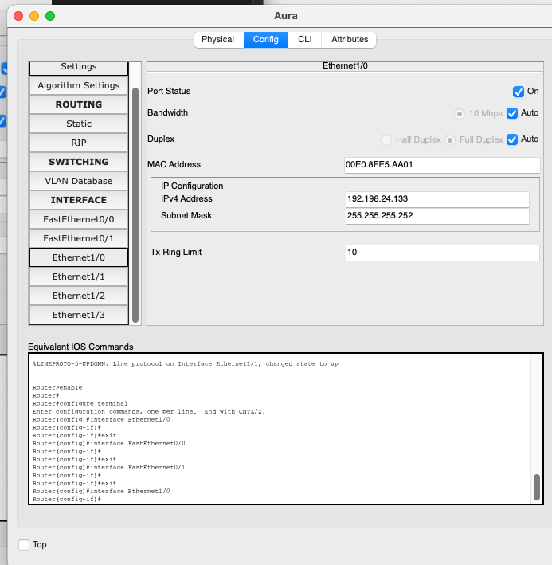
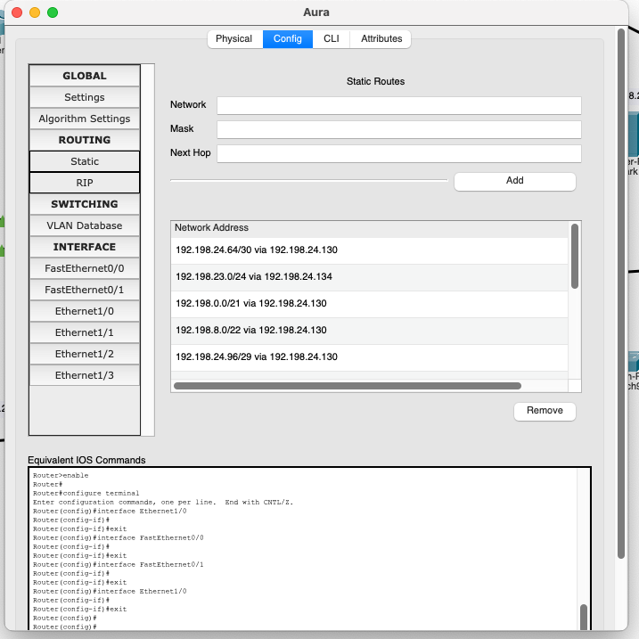


Setting FastEthernet dan Ethernet pada router utama (aura) mengarah ke pada router lain. 
Lalu Routing Static menuju kepada semua subnet.

IP yang digunakan  dari sumber router merupakan increment dari IP subnet tersebut dan IP yang diambil oleh router tujuan merupakan double increment dari IP subnet tersebut.


### Konfiguras Router lain
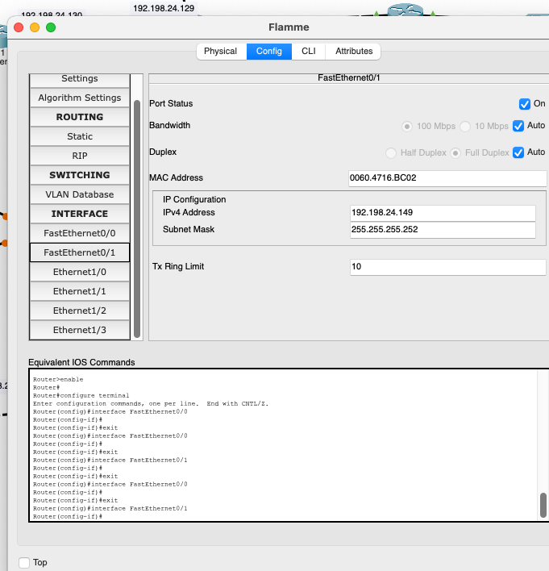


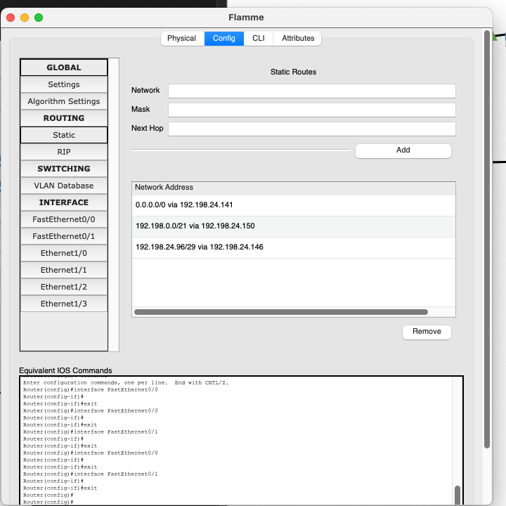

Konfigurasi pada router lain. FastEthernet dan Ethernet menuju kepada router lain. Kemudian routing menuju subnet yang terhubung dengan router yang terhubung kepada router tersebut. 
Lalu default getaway menuju router yang menuju router utama.


### Konfigurasi Client

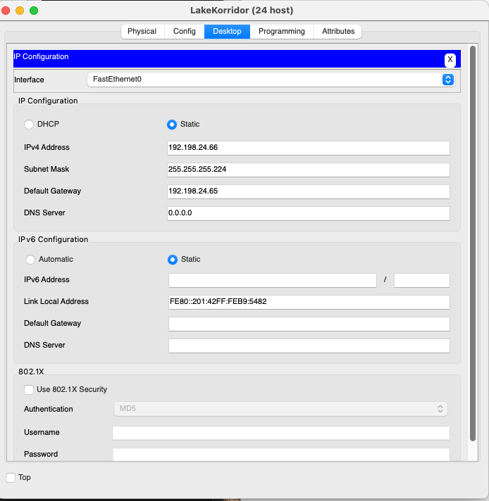

Pada client, konfigurasi IP address merupakan double increment dari Network ID. Default getaway merupakan Address dari gatewaya client tersebut. Yaitu increment satu dari network ID.


### Testing

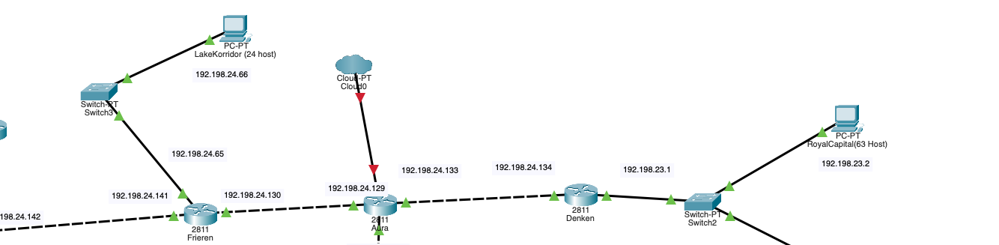

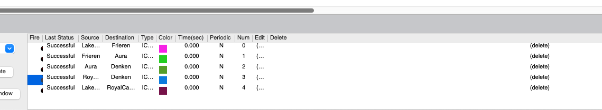

Coba testing dari Client Lakekorridor kepada Royal capital. Pertama ping dari LK ke pada Frieren. Kemudian ping Frieren ke Aura. Ping Aura ke Denken. Kemudian ping Royal Capital dari LK. 


## GNS3 - CIDR

## Penggabungan Subnet CIDR


## Tree CIDR


## Pembagian IP CIDR


## Konfigurasi GNS3
### Aura
```
auto eth0
iface eth0 inet dhcp

auto eth1
iface eth1 inet static
address 192.198.64.1
netmask 255.255.255.252

auto eth2
iface eth2 inet static
address 192.198.176.1
netmask 255.255.255.252

auto eth3
iface eth3 inet static
address 192.198.192.129
netmask 255.255.255.252
```
### Frieren
```
auto lo
iface lo inet loopback

auto eth0
iface eth0 inet static
address 192.198.64.2
netmask 255.255.255.252
gateway 192.198.64.1

auto eth1
iface eth1 inet static
address 192.198.16.17
netmask 255.255.255.128

auto eth2
iface eth2 inet static
address 192.198.32.1
netmask 255.255.255.224
```

### Denken
```
auto eth0
iface eth0 inet static
address 192.198.192.130
netmask 255.255.255.252
gateway 192.198.192.129

auto eth1
iface eth1 inet static
address 192.198.192.1
netmask 255.255.255.128
```

### Eisen
```
auto lo
iface lo inet loopback

auto eth0
iface eth0 inet static
address 192.198.176.2
netmask 255.255.255.252
gateway 192.198.176.1

auto eth1
iface eth1 inet static
address 192.198.129.1
netmask 255.255.255.252

auto eth2
iface eth2 inet static
address 192.198.161.1
netmask 255.255.255.252

auto eth3
iface eth3 inet static
address 192.198.168.1
netmask 255.255.255.252

auto eth4
iface eth4 inet static
address 192.198.144.1
netmask 255.255.255.248
```

### RoyalCapital
```
auto eth0
iface eth0 inet static
address 192.198.192.2
netmask 255.255.255.128
gateway 192.198.192.1
```

### WilleRegion
```
auto eth0
iface eth0 inet static
address 192.198.192.4
netmask 255.255.255.128
gateway 192.198.192.2
```

### LakeKorridor
```
auto eth0
iface eth0 inet static
address 192.198.32.2
netmask 255.255.255.224
gateway 192.198.32.1
```

### Flamme
```
auto lo
iface lo inet loopback

auto eth0
iface eth0 inet static
address 192.198.16.18
netmask 255.255.255.252
gateway 192.198.16.17

auto eth1
iface eth1 inet static
address 192.198.4.1
netmask 255.255.255.252

auto eth2
iface eth2 inet static
address 192.198.8.1
netmask 255.255.252.0

auto eth3
iface eth3 inet static
address 192.198.16.25
netmask 255.255.255.252
```

### RohrRoad
```
auto eth0
iface eth0 inet static
address 192.198.8.2
netmask 255.255.252.0
gateway 192.198.8.1
```

### Fern
```
auto lo
iface lo inet loopback

auto eth0
iface eth0 inet static
address 192.198.4.2
netmask 255.255.255.252
gateway 192.198.4.1

auto eth1
iface eth1 inet static
address 192.198.0.1
netmask 255.255.252.0
```

### LaubHills
```
auto eth0
iface eth0 inet static
address 192.198.0.2
netmask 255.255.252.0
gateway 192.198.0.1
```

### ApettitRegion
```
auto eth0
iface eth0 inet static
address 192.198.0.3
netmask 255.255.252.0
gateway 192.198.0.1
```

### Himmel
```
auto lo
iface lo inet loopback

auto eth0
iface eth0 inet static
address 192.198.16.26
netmask 255.255.255.252
gateway 192.198.16.25

auto eth1
iface eth1 inet static
address 192.198.16.1
netmask 255.255.255.248
```

### SchwerMountains
```
auto eth0
iface eth0 inet static
address 192.198.16.2
netmask 255.255.255.248
gateway 192.198.16.1
```

### Richter
```
auto eth0
iface eth0 inet static
address 192.198.144.2
netmask 255.255.255.248
gateway 192.198.144.1
```

### Revolte
```
auto eth0
iface eth0 inet static
address 192.198.144.3
netmask 255.255.255.248
gateway 192.198.144.1
```

### Stark
```
auto eth0
iface eth0 inet static
address 192.198.168.2
netmask 255.255.255.252
gateway 192.198.168.1
```

### Lugner
```
auto lo
iface lo inet loopback

auto eth0
iface eth0 inet static
address 192.198.161.2
netmask 255.255.255.252
gateway 192.198.161.1

auto eth1
iface eth1 inet static
address 192.198.162.1
netmask 255.255.252.0

auto eth2
iface eth2 inet static
address 192.198.160.1
netmask 255.255.255.0
```

### TurkRegion
```
auto eth0
iface eth0 inet static
address 192.198.162.2
netmask 255.255.252.0
gateway 192.198.162.1
```

### GrobeForest
```
auto eth0
iface eth0 inet static
address 192.198.160.2
netmask 255.255.255.0
gateway 192.198.160.1
```

### Linie
```
auto lo
iface lo inet loopback

auto eth0
iface eth0 inet static
address 192.198.129.2
netmask 255.255.255.252
gateway 192.198.129.1

auto eth1
iface eth1 inet static
address 192.198.130.1
netmask 255.255.255.252

auto eth2
iface eth2 inet static
address 192.198.128.1
netmask 255.255.255.0
```

### GranzChannel
```
auto eth0
iface eth0 inet static
address 192.198.128.2
netmask 255.255.255.0
gateway 192.198.128.1
```

### Lawine
```
auto lo
iface lo inet loopback

auto eth0
iface eth0 inet static
address 192.198.130.2
netmask 255.255.255.252
gateway 192.198.130.1

auto eth1
iface eth1 inet static
address 192.198.136.1
netmask 255.255.255.192
```

### BredtRegion
```
auto eth0
iface eth0 inet static
address 192.198.136.2
netmask 255.255.255.192
gateway 192.198.136.1
```

### Heiter
```
auto lo
iface lo inet loopback

auto eth0
iface eth0 inet static
address 192.198.136.3
netmask 255.255.255.192
gateway 192.198.136.1

auto eth1
iface eth1 inet static
address 192.198.132.1
netmask 255.255.252.0
```

### Sein
```
auto eth0
iface eth0 inet static
address 192.198.132.2
netmask 255.255.252.0
gateway 192.198.132.1
```

### RiegelCanyon
```
auto eth0
iface eth0 inet static
address 192.198.132.3
netmask 255.255.252.0
gateway 192.198.132.1
```

## Routing CIDR
- Dengan route add -net [NID] netmask [netmask] gw [next hop ip address]

### Aura
```
# eth1
route add -net 192.198.32.0 netmask 255.255.255.224 gw 192.198.64.2
route add -net 192.198.8.0 netmask 255.255.252.0 gw 192.198.64.2
route add -net 192.198.0.0 netmask 255.255.252.0 gw 192.198.64.2
route add -net 192.198.16.0 netmask 255.255.255.248 gw 192.198.64.2
# eth2
route add -net 192.198.168.0 netmask 255.255.255.252 gw 192.198.176.2
route add -net 192.198.144.0 netmask 255.255.255.248 gw 192.198.176.2
route add -net 192.198.160.0 netmask 255.255.255.0 gw 192.198.176.2
route add -net 192.198.128.0 netmask 255.255.255.0 gw 192.198.176.2
route add -net 192.198.136.0 netmask 255.255.255.192 gw 192.198.176.2
route add -net 192.198.132.0 netmask 255.255.252.0 gw 192.198.176.2
# eth3
route add -net 192.198.192.0 netmask 255.255.255.128 gw 192.198.192.130
```

### Frieren
```
route add -net 192.198.8.0 netmask 255.255.252.0 gw 192.198.16.18
route add -net 192.198.0.0 netmask 255.255.252.0 gw 192.198.16.18
route add -net 192.198.16.0 netmask 255.255.255.248 gw 192.198.16.18
```

Flamme
```
# eth1
route add -net 192.198.0.0 netmask 255.255.252.0 gw 192.198.4.2
# eth3
route add -net 192.198.16.0 netmask 255.255.255.248 gw 192.198.16.26
```

Eisen
```
# eth1
route add -net 192.198.128.0 netmask 255.255.255.0 gw 192.198.129.2
route add -net 192.198.136.0 netmask 255.255.255.192 gw 192.198.129.2
route add -net 192.198.132.0 netmask 255.255.252.0 gw 192.198.129.2
# eth2
route add -net 192.198.160.0 netmask 255.255.255.0 gw 192.198.161.2
```

Linie
```
route add -net 192.198.136.0 netmask 255.255.255.192 gw 192.198.130.2
route add -net 192.198.132.0 netmask 255.255.252.0 gw 192.198.130.2
```

Lawine
```
ip route add 192.198.132.0/22 via 192.198.136.3
```

## Testing
- Ping IP GrobeForest

```ping 192.198.162.2```
